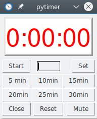
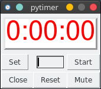

A simple python GUI Countdown timer. It counts seconds from a given minute value that uses the Tkinter GUI toolkit

Basic Tk version by vegaseat:
https://www.daniweb.com/programming/software-development/threads/464062/countdown-clock-with-python

Script based on Pomodoro-Timer:
Laszlo Szathmary, alias Jabba Laci https://github.com/jabbalaci/Pomodoro-Timer

Modified by: Swipe650 https://github.com/Swipe650

Screenshot
---------
Pytimer:

 

Pytimer with no presets:

Usage
-----

Create an application launcher add pytimer_icon.png and execute ./launcher.sh or execute ./pytimer.py

Dependencies
------------

Install the following packages with your package manager:
* wmctrl
* xdotool
* sox

The GUI is based on Tkinter. You will need to install the Tkinter or TK package (depending on your) distro

